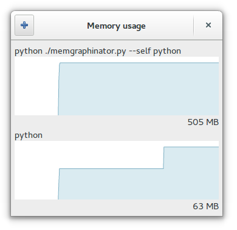

memgraphinator
==============

I want a tool to draw the memory usage graph of a given process over time.
I want to *see* memory leaks.

I couldn't find one so I started writing my own.

Usage
-----

::

    ./memgraphinator.py [--exit-when-process-dies]
    ./memgraphinator.py [--exit-when-process-dies] [-p|--pid] PID ...
    ./memgraphinator.py [--exit-when-process-dies] [--] command [args ...]
    ./memgraphinator.py -h|--help

positional arguments:
  command [args]        Command to execute and monitor

optional arguments:
  -h, --help            Show this help message and exit
  -p PID, --pid PID     Specify existing process to monitor
  --exit-when-process-dies
                        Exit when monitored process dies

Requirements
------------

- Linux (for /proc/{pid}/status)

- Python

- PyGObject with GIR libraries for GTK etc.

.. note:: On Ubuntu be sure to
          ``apt-get install python3-gi python3-gi-cairo gir1.2-gtk-3``

- A reasonably new GTK+ (3.10 is fine but 3.12 is preferred)

Future plans
------------

- Accurate time axis (when you suspend laptop, graph stops, but this is
  not reflected in "N seconds ago" messages)
- Export graph to CSV
