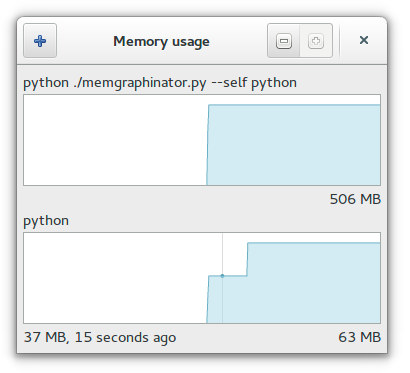

memgraphinator
==============

I want a tool to draw the memory usage graph of a given process over time.
I want to *see* memory leaks.

I couldn't find one so I started writing my own.

Usage
-----

    ./memgraphinator.py [--exit-when-process-dies]
    ./memgraphinator.py [--exit-when-process-dies] [-p|--pid] PID
    ./memgraphinator.py [--exit-when-process-dies] [--] command [args ...]
    ./memgraphinator.py -h|--help

positional arguments:
  command [args]        Command to execute and monitor

optional arguments:
  -h, --help            Show this help message and exit
  -p PID, --pid PID     Specify existing process to monitor
  --exit-when-process-dies
                        Exit when monitored process dies

Requirements
------------

- Python

- PyGObject with GIR libraries for Gtk etc.

- A reasonably new Gtk+ (with header bars etc.)

- Linux (for /proc/{pid}/status)

Future plans
------------

- Ability to quantify the jumps you see in the graph
- Changeable zoom level (1px = 0.1s, 1s, 10s, entire graph)
- Option to remove graphs
- Option to pause graphs
